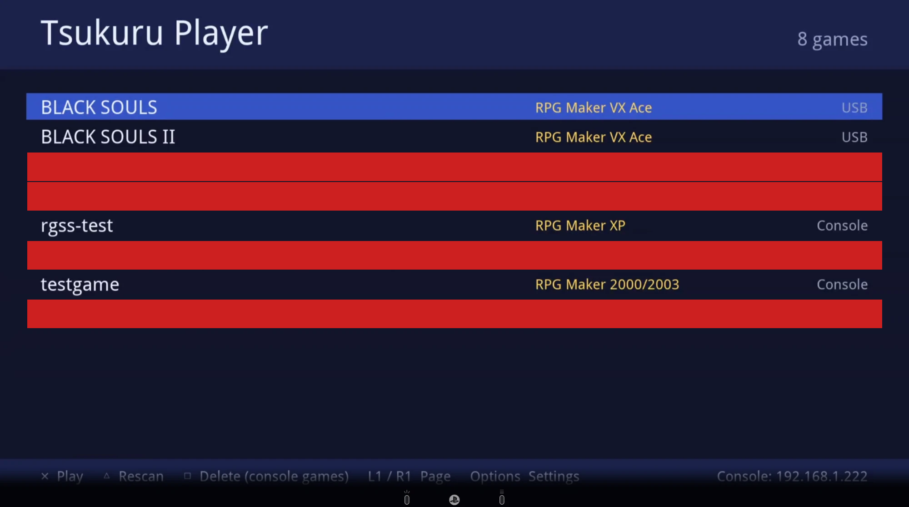
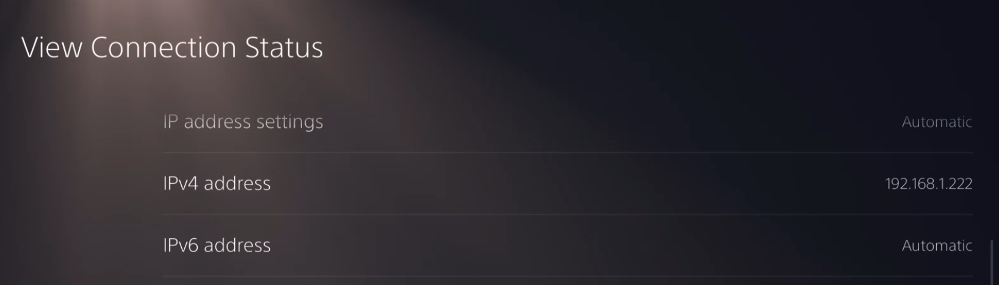

# Tsukuru Player

**Play your RPG Maker games on a jailbroken PlayStation 5.**

<!-- screenshot: 02-game-running.png (a game running on the TV) -->

Tsukuru Player is a small game launcher plus the engines that run RPG Maker games: **2000, 2003, XP, VX, VX Ace, MV and
MZ**. You copy your own games to a USB stick (or to the console), open the **Tsukuru Player** tile on the home screen, pick
a game and press Cross.

It does **not** contain any games, and it does not jailbreak your console. You need a PS5 that is already jailbroken.

---

## What you need

- A **jailbroken PS5** (tested on firmware **13.60**), with the ELF loader running (port 9021).
- The **web launcher** and **FTP server** payloads (`websrv`, `ftpsrv`) started on the console. Most payload menus have them.
- A **USB stick** (exFAT or FAT32) with some free space. (A PC can also copy the bundle over FTP; the stick is simply the easiest way.)
- The **Tsukuru Player bundle**: a folder called `tsukuru-player` (see *Get the bundle* below).
- **Your own RPG Maker games.**
- **Something to open the install page with, once.** Easiest is a **phone or PC on the same network** as the console.
  You can also use the **PS5's own web browser**, if it lets you type an address (see step 4).

## Get the bundle

Download the latest `tsukuru-player` bundle from the project's *Releases* page and unzip it. If there is no release yet, build it
yourself: see [docs/BUILDING.md](docs/BUILDING.md).

## Install (about 5 minutes)

<!-- screenshot: 03-usb-folder.png (the tsukuru-player folder on the stick) -->
1. **Copy the `tsukuru-player` folder** to the top level of your USB stick. Plug the stick into the PS5.
2. **Jailbreak the console** and start **websrv** from your payload menu.
3. **Find the console's address:** *Settings > Network > View Connection Status*. It is the **IPv4 address** (for example `192.168.1.222`).

   

4. **On your phone or PC**, open this address in a browser (use *your* console's address):

   `http://192.168.1.222:8080/fs/mnt/usb0/tsukuru-player/install.html`

   **No phone or PC?** In the PS5's own browser use `127.0.0.1` instead of the console's address:
   `http://127.0.0.1:8080/fs/mnt/usb0/tsukuru-player/install.html`

   If the page says "not found", the stick is not `usb0`: try `usb1`, `usb2`, and so on.
5. **Tap Install.** Notifications in the corner of the TV show the progress (a minute or two). When it says
   *"Tsukuru Player installed"*, open the **Tsukuru Player** tile on the home screen.

<!-- screenshot: 04-install-page.png (the install page on a phone) -->
<!-- screenshot: 05-installed-notification.png (the "installed" notification on the TV) -->

> **What are the files in the folder?** `install.html` is the page you open in step 4; it starts `install.elf`, the installer.
> An `.elf` is a program for the PS5 (like an `.exe` on Windows). You never open it yourself, and the PS5 does not run it just
> because the stick is plugged in. `files` holds the programs that get copied to the console, `licenses` the license texts, and
> `README.txt` the same steps as here.

After the first install, **`tsukuru-installer`** also appears in your payload menu (if you use etaHEN's payload list). To
update later, plug in the stick with the new bundle and start it from there: no phone needed.

## Add your games

Pick one:

- **USB stick (easiest):** make a folder called `games` on the stick and put each game in its own folder inside it.
  Plug the stick in before you open Tsukuru Player.
- **From a PC:** start `ftpsrv` on the console, then drag a game folder onto **`add-game.bat`** (it asks for the console's
  address). The game is copied to the console's own storage.
- **From a phone:** start `ftpsrv`, then use any FTP app: host = the console's address, port **2121**, no user name or
  password. Copy the game folders to `/data/games`.

<!-- screenshot: 06-games-folder.png (the games folder on the stick) -->

## Play

Open the **Tsukuru Player** tile, move with the D-pad or left stick, and press **Cross** to start.

| Button | What it does |
| --- | --- |
| Cross | Start the selected game |
| Triangle | Look for games again |
| Square | Delete the selected game (only games stored on the console; press twice) |
| L1 / R1 | Page up / down |
| Options | Settings: map pad buttons to game buttons and keyboard keys, picture scaling, pointer speed |

Inside games, the touchpad is the mouse. A red **`!`** next to a game means the launcher has something to tell you about it:
select it and read the message at the bottom (a missing RTP, or files it cannot read).

<!-- screenshot: 07-settings.png (the Settings screen) -->

## Which games work

| Game made with | Runs on | How well |
| --- | --- | --- |
| RPG Maker 2000 / 2003 | EasyRPG Player | Good |
| RPG Maker XP / VX / VX Ace | mkxp-z | Good. A game that needs real Windows DLLs does not work. |
| RPG Maker MV / MZ | The Outsider runtime | Good for most games. Heavy scenes can drop below 30 frames per second. |

Only a handful of games have been tested so far, so some will not work. **Games that need Steam or other Windows-only
programs, that use their own file protection, or that call the internet may not run.** If a game closes by itself, open
Tsukuru Player again: the bottom of the screen shows the last error the game printed. Please include it when you report a problem.

Tested so far (not a promise for other games): a large translated 2000/2003 game, two large VX Ace games, a large XP fan game,
an MZ game, and a few MV games.

## If something goes wrong

| Problem | What to try |
| --- | --- |
| The page `install.html` is "not found" | The stick is not `usb0`: try `usb1` or `usb2`. Make sure websrv is running and the stick is plugged in. |
| "Cannot reach the web launcher" | Start **websrv** (and **ftpsrv** for FTP) again. They stop whenever the console restarts, and you have to jailbreak again after every restart. |
| The game list is empty | Check the folder is called `games` on the stick (or `/data/games` on the console), then press Triangle. |
| A game shows a red `!` | Select it and read the message. Often it needs the **RTP**: see [docs/EXTRAS.md](docs/EXTRAS.md). |
| A game starts, then the screen goes back to the home screen | Open Tsukuru Player again: the bottom line says why. |
| Black screen | Wait about 30 seconds (big games load slowly), then check the message in the launcher. |
| No music in an XP/VX/VX Ace game | MIDI needs a SoundFont: see [docs/EXTRAS.md](docs/EXTRAS.md). |
| The console restarted | Jailbreak again and start websrv and ftpsrv again. Games and settings are kept. |

## Good to know

- **Saves** are written into each game's own folder, so they stay with the game (on the stick, if the game is on the stick).
- The **web launcher and FTP server have no password** while they run. Only use them on a network you trust.
- Going online with a modified console can get it or your account banned. Keep it offline.
- There is no uninstaller yet. To remove everything, delete the folders `/data/homebrew/rpgmaker`, `outsider`, `easyrpg`
  and `mkxp-z`, and `/user/homebrew/lib/libOSMesa.so.8`, and remove the tile from the home screen.

## Legal

This project contains no games, no RPG Maker runtime files (RTP), no exploit code and no Sony files. It is made for playing
games you own or are licensed to play. Read [LEGAL.md](LEGAL.md) before sharing it. RPG Maker is a trademark of Kadokawa
Corporation, and PlayStation and PS5 are trademarks of Sony Interactive Entertainment. This project is not affiliated with
either company.

## For developers

- [docs/BUILDING.md](docs/BUILDING.md): what is in this repository, how to build everything, how the pieces fit together.
- [docs/EXTRAS.md](docs/EXTRAS.md): RTP, SoundFonts, converting `.wma` music.
- [docs/SCREENSHOTS.md](docs/SCREENSHOTS.md): the screenshots the README is waiting for.

## Credits and licenses

Tsukuru Player is licensed under the **GNU General Public License, version 3 or later** (see `LICENSE`). It is built on
[EasyRPG Player](https://github.com/EasyRPG/Player), [mkxp-z](https://gitlab.com/mkxp-z/mkxp-z), the
[Outsider](https://github.com/GeneralArcade/outsider) runtime (QuickJS-NG, SoLoud), and the
[ps5-payload-sdk](https://github.com/ps5-payload-dev/sdk) with its SDL port, websrv and ftpsrv, plus Ruby, Mesa, LLVM, SDL2
and others. The complete list with licenses is in [THIRD-PARTY-NOTICES.md](THIRD-PARTY-NOTICES.md).
